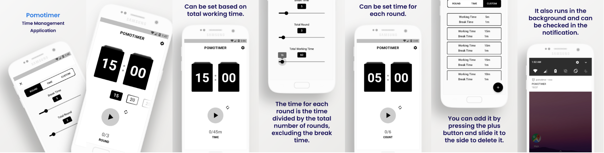

## POTIMER

`POMOTIMER` is most simplified Time Management Application.

### About POMOTIMER

POMOTIMER is an application that applies pomodoro technique.

The `Pomodoro` technique is a method of concentrating for a certain amount of time and taking a short break at the end of that time. I usually focus for 25 minutes and take a rest for about 5 minutes.

- Settings
    1. Round
        - Break Time
        - Total Round  
        \* The time per round is selected using wheel list on home

    2. Time
        - Break Time
        - Total Round
        - Total Working Time  
        \* The time per round is `(Total Working Time - (Break Time * Total Round)) / Total Round`
    
    3. Custom
        - pair of Break Time and Working time

### Download

- GooglePlayStore: [pomotimer](https://play.google.com/store/apps/details?id=com.pomotimer.jade.app)
